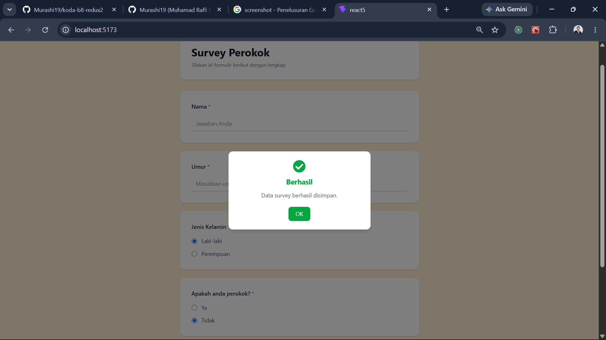
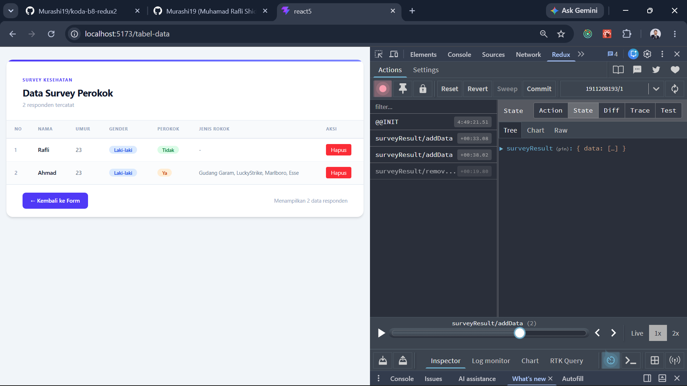
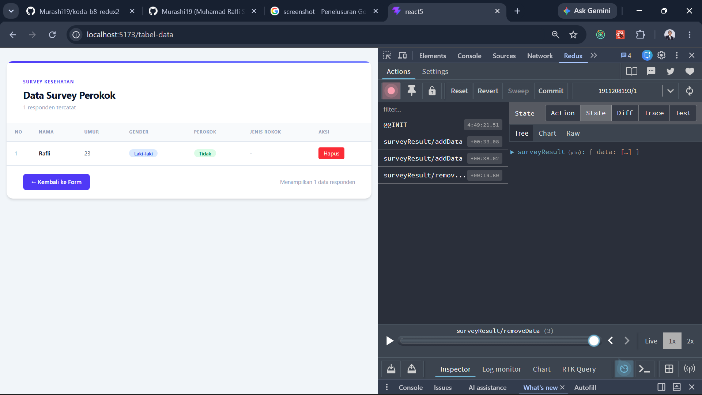

# Smoker Survey Form

A ReactJS survey application built using React Hook Form, Yup Validation, and Redux Toolkit. The application allows users to submit smoker survey data, manage survey records through Redux state management, and display submitted responses in
a data table.

## Features

- Form state management with React Hook Form
- Schema-based validation using Yup
- Global state management with Redux Toolkit
- Add survey data to Redux Store
- Remove survey data from Redux Store
- Display submitted survey responses in a table
- Dynamic rendering of survey records
- Responsive user interface
- Client-side validation with custom error messages
- Success modal notification after form submission
- User confirmation message before submitting survey data

---

## Getting Started

### 1. Create React Project

```bash
npm create vite@latest smoker-survey-form -- --template react
```

### 2. Install Dependencies

```bash
npm install
npm install react-hook-form yup @hookform/resolvers
npm install @reduxjs/toolkit react-redux
```

### 3. Run the Application

```bash
npm run dev
```

---

## Project Structure

```text
src/
│
├── pages/
│   ├── SurveyForm.jsx
│   └── TabelData.jsx
│
├── redux/
│   ├── reducers/
│   │   ├── surveyResult.js
│   │   └── index.js
│   │
│   └── store.js
│
├── App.jsx
└── main.jsx
```

---

## Survey Flow

1. User fills out the smoker survey form.
2. Form data is validated using Yup.
3. If validation passes, the survey data is dispatched to Redux Store.
4. Redux reducer updates the application state.
5. The table page retrieves survey data using useSelector.
6. Survey records are rendered dynamically in the table.
7. Users can remove survey data using Redux actions.

---

## Redux State Management

This application uses Redux Toolkit for centralized state management.

### Reducers

- addData → Add a new survey record
- removeData → Remove a survey record

### Hooks Used

#### useDispatch

Used to send actions to Redux Store.

Example:

```js
dispatch(addData(data));
```

#### useSelector

Used to access Redux state.

Example:

```js
const surveys = useSelector((state) => state.surveyResult.data);
```

---

## Validation

The application uses:

- React Hook Form for form handling
- Yup for schema validation
- @hookform/resolvers for integrating Yup with React Hook Form

Validation rules include:

- Required fields
- Minimum and maximum character length
- Number validation
- Age restrictions
- Radio button validation
- Checkbox validation

---

## Tech Stack

- ReactJS
- Vite
- React Hook Form
- Yup
- Redux Toolkit
- React Redux
- Tailwind CSS

---

## Learning Objectives

- Building forms with React
- Managing form state using React Hook Form
- Creating validation schemas with Yup
- Implementing Redux Toolkit state management
- Using createSlice and configureStore
- Dispatching Redux actions
- Accessing global state with useSelector
- Rendering dynamic table data
- Implementing client-side validation
- Building responsive user interfaces
- Understanding centralized state management

### Implementation Screenshot Results

survey form successfully submitted data  survey data table  

```

```
